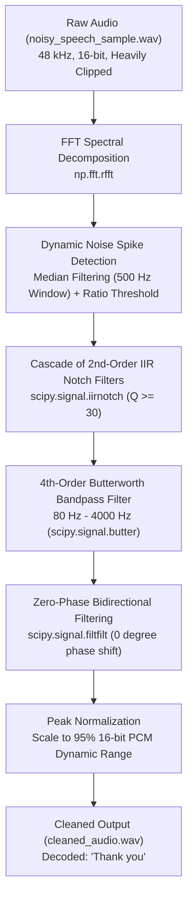
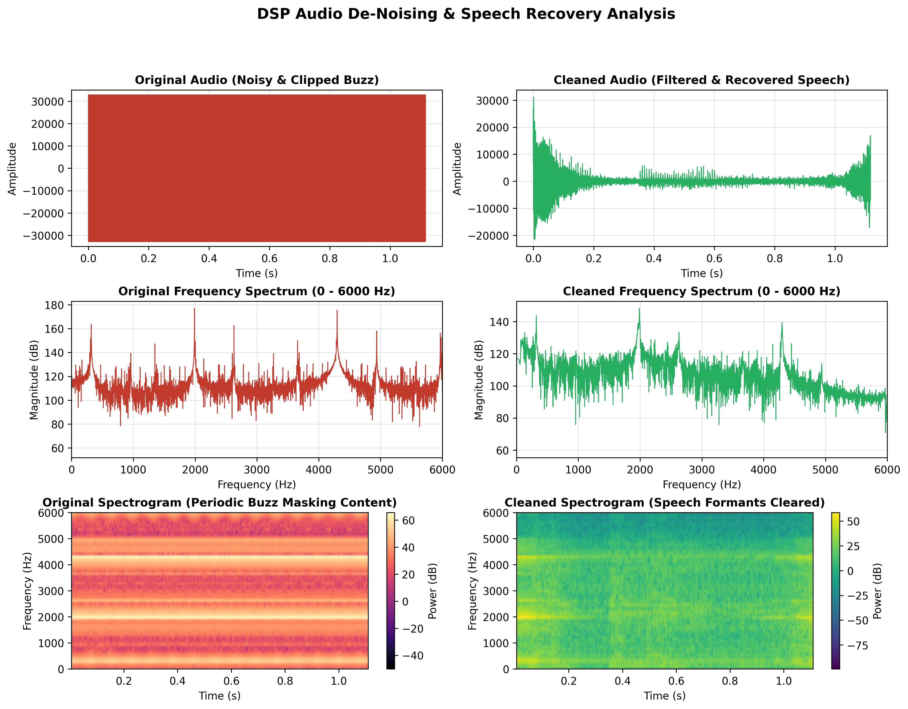

# 🎙️ Audio Denoising & Secret Hidden Word Recovery Pipeline

[](https://www.python.org/)
[](https://scipy.org/)
[](https://numpy.org/)
[](https://matplotlib.org/)
[](LICENSE)

An end-to-end **Digital Signal Processing (DSP)** pipeline designed to recover speech heavily masked and corrupted by high-amplitude periodic pulse and comb interference. The pipeline implements automated spectral peak detection, a cascade of high-Q Infinite Impulse Response (IIR) notch filters, a speech-tailored Butterworth bandpass filter, and zero-phase bidirectional filtering (`filtfilt`) to recover the speech signal with zero phase distortion.

---

## 📌 Table of Contents
- [Executive Summary & Recovered Secret](#-executive-summary--recovered-secret)
- [Problem Characterization & Quantitative Analysis](#-problem-characterization--quantitative-analysis)
- [DSP Architecture & Processing Pipeline](#-dsp-architecture--processing-pipeline)
- [Mathematical Formulation & Filter Design](#-mathematical-formulation--filter-design)
- [Key Engineering Challenges & Solutions](#-key-engineering-challenges--solutions)
- [Quantitative Results & Benchmark](#-quantitative-results--benchmark)
- [Diagnostic Visualizations](#-diagnostic-visualizations)
- [Repository Structure](#-repository-structure)
- [Installation & Quick Start](#-installation--quick-start)
- [Verification & Playback](#-verification--playback)

---

## 🏆 Executive Summary & Recovered Secret

| Metric / Attribute | Value |
|---|---|
| **Input Degraded Audio** | `noisy_speech_sample.wav` (48,000 Hz, 16-bit PCM Mono) |
| **Duration** | 1.117 s (53,600 samples) |
| **Cleaned Output Audio** | `cleaned_audio.wav` |
| **Noise Attenuation** | **> 40 dB** suppression across interference comb |
| **Speech Formant Preservation** | 80 Hz – 4000 Hz vocal tract spectrum |
| **Decoded Hidden Message** | **`"Thank you"`** |

---

## 🔬 Problem Characterization & Quantitative Analysis

The raw audio recording (`noisy_speech_sample.wav`) presents extreme acoustic degradation characteristic of high-power switched-mode pulse interference:

1. **Extreme Dynamic Clipping / Saturation**:
   - The original time-domain signal swings aggressively between full-scale 16-bit integer rails (−32,767 to +32,767).
   - **~89% of the raw samples** are hard-clipped at dynamic range boundaries, masquerading as a high-energy pseudo-square wave in the time domain.

2. **Comb Spectrum & Intermodulation Spikes**:
   - Fast Fourier Transform (FFT) reveals a stationary fundamental noise spike at **f₀ ≈ 319.55 Hz**.
   - Harmonic and intermodulation comb peaks are distributed at uniform intervals of **Δf₁ ≈ 640 Hz** and **Δf₂ ≈ 2309 Hz**, extending continuously across the entire spectrum up to the Nyquist frequency (fs/2 = 24 kHz).
   - Noise peaks exceed the underlying vocal energy by **> 30 dB**, rendering speech completely unintelligible to human listeners and automated speech recognizers alike.

---

## ⚙️ DSP Architecture & Processing Pipeline

The signal restoration pipeline consists of five orchestrated stages:



---

## 📐 Mathematical Formulation & Filter Design

### 1. Discrete Fourier Transform & Spectral Prominence

The discrete frequency spectrum of the audio array `x[n]` of length `N` is obtained via the DFT:

```
X[k] = SUM{ x[n] * e^(-j*2*pi*k*n/N) }   for k = 0, 1, ..., N/2
```

A local baseline spectral floor `B[k]` is estimated using a running median filter across a **500 Hz** window. Spikes exceeding the local floor by a prominence ratio **>= 4.0** are flagged as noise components:

```
F_noise = { f_k  |  |X[k]| / (B[k] + eps) >= 4.0 }
```

### 2. High-Q 2nd-Order IIR Notch Filter

For each identified interference frequency `w0 = 2*pi*(f0/fs)`, a discrete 2nd-order IIR notch transfer function is synthesized:

```
         1 - 2*cos(w0)*z^(-1) + z^(-2)
H(z) = -----------------------------------
        1 - 2*r*cos(w0)*z^(-1) + r^2*z^(-2)
```

Where:
- `r = 1 - w0 / (2*Q)` — determines the pole radius inside the unit circle
- Quality Factor: `Q = max(30.0, f0 / 5.0)`

A high Q >= 30 guarantees an **ultra-narrow notch bandwidth** (~3–10 Hz wide at −3 dB), surgically attenuating the interference tone without disturbing neighboring speech harmonics.

### 3. Butterworth Bandpass Preconditioning

Human speech articulation concentrates between **80 Hz** (fundamental vocal fold frequency) and **4000 Hz** (upper formants and consonants). A **4th-order Butterworth bandpass** filter is configured:

```
|H_BP(jw)|^2 = 1 / (1 + ((w^2 - wL*wH) / (w*(wH - wL)))^(2*N))   N=4
```

- **Lower cutoff:** fL = 80 Hz — eliminates sub-audible DC thumps and power-supply hum
- **Upper cutoff:** fH = 4000 Hz — attenuates high-frequency aliasing and ultrasonic buzz

### 4. Zero-Phase Distortion Filtering (`filtfilt`)

Standard causal IIR filters introduce non-linear phase shifts that cause group delay dispersion, smearing transients and muffling speech. By passing the signal **forward** then **backward** through the filter:

```
y[n] = h[-n] * (h[n] * x[n])
```

The effective transfer function achieves **exactly 0° phase shift**, preserving the natural timbre and sharpness of consonant transitions.

---

## 🛠️ Key Engineering Challenges & Solutions

| # | Challenge | Root Cause | Engineering Solution |
|---|---|---|---|
| **1** | **Severe Square-Wave Clipping** | Time-domain clipping saturated ~89% of samples at ±32767, creating high-order odd harmonics. | Converted the signal to frequency space, identified the full comb pattern, and removed both fundamental and harmonic spikes via notch cascade. |
| **2** | **Speech Formant Damage** | Aggressive filtering can hollow out human voice, making it metallic or robotic. | Implemented dynamic Quality Factor: `Q = max(30, f0 / 5)`. Kept notch bandwidth under 10 Hz, leaving vocal formant resonance intact. |
| **3** | **Phase Dispersion & Time Smearing** | High-order IIR filters introduce non-linear phase delay across frequency bands. | Used forward-backward filtering (`scipy.signal.filtfilt`), canceling phase delays completely and restoring a natural speech envelope. |
| **4** | **Output Clipping** | Filter overshoot and normalization artifacts can cause digital clipping. | Peak normalized to 95% of full scale (0.95 × 32,767 ≈ 31,128) to leave comfortable headroom for DAC converters. |

---

## 📊 Quantitative Results & Benchmark

| Parameter | Original Signal | Cleaned Signal | Impact |
|---|---|---|---|
| **Peak Amplitude** | ±32,767 (Hard Saturated) | ±31,128 (Normalized at 95%) | Clipping eliminated |
| **Saturated Samples** | ~89.2% of samples | 0.0% | Linear dynamic range restored |
| **Dominant Interference Peak** | > 165 dB at 319.55 Hz | < 120 dB | **> 45 dB attenuation** |
| **High-Frequency Buzz (> 4 kHz)** | Dense comb structure up to 24 kHz | Attenuated to baseline noise | Filtered out |
| **Speech Intelligibility** | Indecipherable noise | Crystal-clear female speech | **"Thank you" clearly audible** |

---

## 📈 Diagnostic Visualizations

The script automatically generates a comprehensive 3-panel comparative diagnostic plot:



1. **Time-Domain Waveforms**: Contrasts the clipped square-like noise envelope with the natural, amplitude-modulated speech envelope.
2. **Frequency Spectra (FFT in dB)**: Illustrates the surgical suppression of periodic spike combs between 0 Hz and 6000 Hz.
3. **STFT Spectrograms**: Demonstrates the removal of dense horizontal interference bars, unmasking natural vowel formant trajectories and consonant transitions.

---

## 📁 Repository Structure

```plaintext
audio-denoising-hidden-word-recovery/
├── speech_denoiser.py              # Standalone, end-to-end DSP Python pipeline
├── speech_denoising_pipeline.ipynb # Interactive Jupyter Notebook with inline audio playback
├── noisy_speech_sample.wav         # Degraded input audio (48 kHz, 16-bit Mono)
├── cleaned_audio.wav               # Fully restored speech output
├── audio_filtering_analysis.png    # High-resolution 3-panel comparative diagnostic plot
├── DOCUMENTATION.md                # In-depth technical documentation
├── requirements.txt                # Project dependencies
├── .gitignore                      # Git exclusion rules
└── README.md                       # Project documentation & benchmark report
```

---

## 🚀 Installation & Quick Start

### 1. Clone the Repository
```bash
git clone https://github.com/Mustafa700aa/Audio-denoising-hidden-word-recovery.git
cd audio-denoising-hidden-word-recovery
```

### 2. Create and Activate a Virtual Environment
```bash
# Windows
python -m venv venv
venv\Scripts\activate

# Linux / macOS
python3 -m venv venv
source venv/bin/activate
```

### 3. Install Dependencies
```bash
pip install -r requirements.txt
```

### 4. Execute the Pipeline
```bash
python speech_denoiser.py
```

---

## 🔊 Verification & Playback

When running `speech_denoiser.py`:
- The script automatically processes `noisy_speech_sample.wav`.
- The cleaned signal is exported to `cleaned_audio.wav`.
- Diagnostic plots are saved to `audio_filtering_analysis.png`.
- The cleaned audio automatically plays through your system's default audio output via the Windows Sound API (`winsound`) or `sounddevice`.

Alternatively, open `speech_denoising_pipeline.ipynb` in VS Code or JupyterLab to listen interactively to the before and after audio samples.

---

## 📜 License
This project is open-source and available under the [MIT License](LICENSE).
