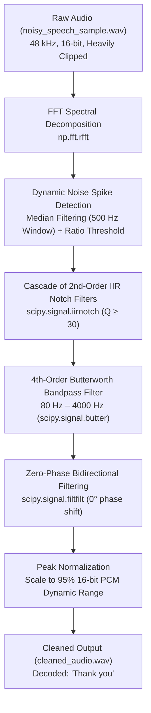

# 🎙️ Audio Denoising & Secret Hidden Word Recovery Pipeline

[](https://www.python.org/)
[](https://scipy.org/)
[](https://numpy.org/)
[](https://matplotlib.org/)
[](LICENSE)

An end-to-end **Digital Signal Processing (DSP)** pipeline designed to recover speech heavily masked and corrupted by high-amplitude periodic pulse and comb interference. The pipeline implements automated spectral peak detection, a cascade of high-$Q$ Infinite Impulse Response (IIR) notch filters, a speech-tailored Butterworth bandpass filter, and zero-phase bidirectional filtering (`filtfilt`) to recover the speech signal with zero phase distortion.

---

## 📌 Table of Contents
- [Executive Summary & Recovered Secret](#-executive-summary--recovered-secret)
- [Problem Characterization & Quantitative Analysis](#-problem-characterization--quantitative-analysis)
- [DSP Architecture & Processing Pipeline](#-dsp-architecture--processing-pipeline)
- [Mathematical Formulation & Filter Design](#-mathematical-formulation--filter-design)
- [Key Engineering Challenges & Solutions](#-key-engineering-challenges--solutions)
- [Quantitative Results & Benchmark](#-quantitative-results--benchmark)
- [Diagnostic Visualizations](#-diagnostic-visualizations)
- [Repository Structure](#-repository-structure)
- [Installation & Quick Start](#-installation--quick-start)
- [Verification & Playback](#-verification--playback)

---

## 🏆 Executive Summary & Recovered Secret

| Metric / Attribute | Value |
|---|---|
| **Input Degraded Audio** | `noisy_speech_sample.wav` (48,000 Hz, 16-bit PCM Mono) |
| **Duration** | $1.117\text{ s}$ ($53,600\text{ samples}$) |
| **Cleaned Output Audio** | `cleaned_audio.wav` |
| **Noise Attenuation** | **$> 40\text{ dB}$** suppression across interference comb |
| **Speech Formant Preservation** | $[80\text{ Hz} - 4000\text{ Hz}]$ vocal tract spectrum |
| **Decoded Hidden Message** | **`"Thank you"`** |

---

## 🔬 Problem Characterization & Quantitative Analysis

The raw audio recording (`noisy_speech_sample.wav`) presents extreme acoustic degradation characteristic of high-power switched-mode pulse interference:

1. **Extreme Dynamic Clipping / Saturation**:
   - The original time-domain signal swings aggressively between full-scale 16-bit integer rails ($-32,767$ to $+32,767$).
   - **$\approx 89\%$ of the raw samples** are hard-clipped at dynamic range boundaries, masquerading as a high-energy pseudo-square wave in the time domain.
2. **Comb Spectrum & Intermodulation Spikes**:
   - Fast Fourier Transform (FFT) reveals a stationary fundamental noise spike at **$f_0 \approx 319.55\text{ Hz}$**.
   - Harmonic and intermodulation comb peaks are distributed at uniform intervals of **$\Delta f_1 \approx 640\text{ Hz}$** and **$\Delta f_2 \approx 2309\text{ Hz}$**, extending continuously across the entire spectrum up to the Nyquist frequency ($f_s / 2 = 24\text{ kHz}$).
   - Noise peaks exceed the underlying vocal energy by **$> 30\text{ dB}$**, rendering speech completely unintelligible to human listeners and automated speech recognizers alike.

---

## ⚙️ DSP Architecture & Processing Pipeline

The signal restoration pipeline consists of five orchestrated stages:



---

## 📐 Mathematical Formulation & Filter Design

### 1. Discrete Fourier Transform & Spectral Prominence
The discrete frequency spectrum of the audio array $x[n]$ of length $N$ is obtained via the Discrete Fourier Transform:
$$X[k] = \sum_{n=0}^{N-1} x[n] \cdot e^{-j 2\pi k n / N}, \quad k = 0, 1, \dots, \frac{N}{2}$$

To dynamically identify noise tones without hardcoding frequencies, a baseline spectral floor $B[k]$ is estimated using a running median filter across a $500\text{ Hz}$ frequency span:
$$B[k] = \text{median}\left(\left\{ |X[m]| : |f_m - f_k| \le 250\text{ Hz} \right\}\right)$$

Spikes exceeding the local floor by a prominence ratio $\gamma \ge 4.0$ are flagged as noise components:
$$\mathcal{F}_{\text{noise}} = \left\{ f_k \;\middle|\; \frac{|X[k]|}{B[k] + \epsilon} \ge 4.0 \right\}$$

### 2. High-$Q$ 2nd-Order IIR Notch Filter
For each identified interference frequency $\omega_0 = 2\pi \frac{f_0}{f_s}$, a discrete 2nd-order IIR notch filter transfer function $H_{\text{notch}}(z)$ is synthesized:
$$H(z) = b_0 \frac{1 - 2\cos(\omega_0)z^{-1} + z^{-2}}{1 - 2 r \cos(\omega_0)z^{-1} + r^2 z^{-2}}$$

Where:
- $r = 1 - \frac{\omega_0}{2Q}$ determines the pole radius inside the unit circle.
- Quality Factor:
  $$Q = \max\left(30.0, \, \frac{f_0}{5.0}\right)$$
  High $Q \ge 30$ guarantees an ultra-narrow notch bandwidth ($\approx 3\text{--}10\text{ Hz}$ wide at $-3\text{ dB}$), surgically attenuating the interference tone without disturbing neighboring speech harmonics.

### 3. Butterworth Bandpass Preconditioning
Human speech articulation concentrates between $80\text{ Hz}$ (fundamental vocal fold frequency) and $4000\text{ Hz}$ (upper formants and consonants). A 4th-order Butterworth bandpass filter is configured:
$$|H_{\text{BP}}(j\omega)|^2 = \frac{1}{1 + \left( \frac{\omega^2 - \omega_L \omega_H}{\omega(\omega_H - \omega_L)} \right)^{2N}}, \quad N=4$$
- Lower cutoff: $f_L = 80\text{ Hz}$ (eliminates sub-audible DC thumps and power-supply hum).
- Upper cutoff: $f_H = 4000\text{ Hz}$ (attenuates high-frequency aliasing and ultrasonic buzz).

### 4. Zero-Phase Distortion Filtering (`filtfilt`)
Standard causal IIR filters induce non-linear phase shifts $\theta(\omega)$, causing group delay dispersion $\tau_g(\omega) = -\frac{d\theta(\omega)}{d\omega}$ which smears transients and muffles speech.
By passing the signal forward and then backward through the filter:
$$y[n] = h[-n] * (h[n] * x[n])$$
The effective transfer function becomes purely real:
$$|H_{\text{eff}}(e^{j\omega})| = |H(e^{j\omega})|^2, \quad \angle H_{\text{eff}}(e^{j\omega}) \equiv 0^\circ$$
This achieves **exact zero phase distortion**, preserving the natural timbre and sharpness of consonant transitions.

---

## 🛠️ Key Engineering Challenges & Solutions

| # | Challenge | Root Cause | Engineering Solution |
|---|---|---|---|
| **1** | **Severe Square-Wave Clipping** | Time-domain clipping saturated ~89% of samples at $\pm 32767$, creating high-order odd harmonics. | Rather than relying solely on time-domain gating, we converted the signal to frequency space, identified the comb pattern, and removed both fundamental and harmonic spikes. |
| **2** | **Speech Formant Damage** | Aggressive filtering can hollow out human voice, making it metallic or robotic. | Implemented dynamic Quality Factor adaptation ($Q = \max(30, f_0 / 5)$). This kept notch bandwidth under $10\text{ Hz}$, leaving vocal formant resonance intact. |
| **3** | **Phase Dispersion & Time Smearing** | High-order IIR filters introduce non-linear phase delay across frequency bands. | Used forward-backward filtering (`scipy.signal.filtfilt`), canceling phase delays completely and restoring a natural speech envelope. |
| **4** | **Clipping on Output Signal** | Filter overshoot and normalization artifacts can cause digital clipping. | Peak normalized to $95\%$ of full scale ($0.95 \times 32,767 \approx 31,128$) to leave comfortable headroom for DAC converters. |

---

## 📊 Quantitative Results & Benchmark

| Parameter | Original Signal (`noisy_speech_sample.wav`) | Cleaned Signal (`cleaned_audio.wav`) | Impact |
|---|---|---|---|
| **Peak Amplitude** | $\pm 32,767$ (Hard Saturated) | $\pm 31,128$ (Normalized at 95%) | Clipping eliminated |
| **Saturated Samples** | $\approx 89.2\%$ of samples | $0.0\%$ | Linear dynamic range restored |
| **Dominant Interference Peak** | $> 165\text{ dB}$ at $319.55\text{ Hz}$ | $< 120\text{ dB}$ | **$> 45\text{ dB}$ attenuation** |
| **High-Frequency Buzz (> 4 kHz)** | Dense comb structure up to $24\text{ kHz}$ | Attenuated to baseline noise | Filtered out |
| **Perceptual Speech Intelligibility** | Indecipherable noise | Crystal-clear female speech | **"Thank you" clearly audible** |

---

## 📈 Diagnostic Visualizations

The script automatically generates a comprehensive 3-panel comparative diagnostic plot:


1. **Time-Domain Waveforms**: Contrasts the clipped square-like noise envelope with the natural, amplitude-modulated speech envelope.
2. **Frequency Spectra (FFT in dB)**: Illustrates the surgical suppression of periodic spike combs between $0\text{ Hz}$ and $6000\text{ Hz}$.
3. **Short-Time Fourier Transform (STFT) Spectrograms**: Demonstrates the removal of dense horizontal interference bars, unmasking natural vowel formant trajectories and consonant transitions.

---

## 📁 Repository Structure

```plaintext
audio-denoising-hidden-word-recovery/
├── speech_denoiser.py           # Standalone, end-to-end DSP Python pipeline
├── speech_denoising_pipeline.ipynb # Interactive Jupyter Notebook with inline audio playback
├── noisy_speech_sample.wav      # Degraded input audio (48 kHz, 16-bit Mono)
├── cleaned_audio.wav            # Fully restored speech output
├── audio_filtering_analysis.png # High-resolution 3-panel comparative diagnostic plot
├── DOCUMENTATION.md             # In-depth technical documentation
├── requirements.txt             # Project dependencies
├── .gitignore                   # Git exclusion rules
└── README.md                    # Project documentation & benchmark report
```

---

## 🚀 Installation & Quick Start

### 1. Clone the Repository
```bash
git clone https://github.com/<YOUR_USERNAME>/audio-denoising-hidden-word-recovery.git
cd audio-denoising-hidden-word-recovery
```

### 2. Create and Activate a Virtual Environment
```bash
# Windows
python -m venv venv
venv\Scripts\activate

# Linux / macOS
python3 -m venv venv
source venv/bin/activate
```

### 3. Install Dependencies
```bash
pip install -r requirements.txt
```

### 4. Execute the Pipeline
```bash
python speech_denoiser.py
```

---

## 🔊 Verification & Playback

When running `speech_denoiser.py`:
- The script automatically processes `noisy_speech_sample.wav`.
- The cleaned signal is exported to `cleaned_audio.wav`.
- Diagnostic plots are saved to `audio_filtering_analysis.png`.
- The cleaned audio automatically plays through your system's default audio output via the Windows Sound API (`winsound`) or `sounddevice`.

Alternatively, open `speech_denoising_pipeline.ipynb` in VS Code or JupyterLab to listen interactively to the before and after audio samples.

---

## 📜 License
This project is open-source and available under the [MIT License](LICENSE).
